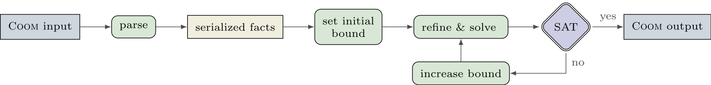

# Cargo Bike

The Cargo Bike is a product configuration problem
written in the [COOM\[X*\]][xoomstar] language fragment.
As this example contains unbounded cardinalities,
the current encoding is not able to solve this natively.
Therefore, the *COOM Suite* offers the `--bounds` option
providing a simple approach which increases the maximum bound in a stepwise
manner until reaching a solution. This approach is captured in the following diagram.



The maximum bound is either increased in a `linear` or `exponential` manner.
These are the two alternatives that can be supplied to the `--bounds` option.
Furthermore, the start value for the maximum bound can be controlled with
the option `--initial-bound` (the default is 0).

!!! info "Acknowledgements"
    The Cargo Bike example has been provided by [denkbares].

[xoomstar]: ../reference/coom/index.md#unbounded-cardinalities
[denkbares]: https://denkbares.com

## Usage

```console
coomsuite solve examples/coom/bike/cargo-bike.coom -u examples/coom/bike/user-input-cargo.coom --bounds linear
```

!!! info "Multi-shot solving"
    By default the standard COOM encoding is used when the `--bounds` option is active.
    To avoid repeatedly grounding (and solving) the same parts of the problem,
    the COOM suite also includes a [multi-shot encoding][multi-shot].
    It can be used by adding the option `--multishot`.

[multi-shot]: ../reference/encodings/multishot/index.md

## COOM model

<!-- ??? quote "COOM Model" -->
<!-- title="Cargo Bike" linenums="1" -->
```cpp
--8<-- "examples/coom/bike/cargo-bike.coom:5:33"
```

## Example solution

```shell
Solving with max_bound = 1
UNSATISFIABLE

Solving with max_bound = 2
UNSATISFIABLE

Solving with max_bound = 3
Answer: 1
bags[0]
bags[1]
bags[2]
requestedVolume[0] = 60
totalVolume[0]     = 60

bags[0].size[0] = "large"
bags[0].size[0].volume[0] = 20
bags[0].size[0].weight[0] = 25

bags[1].size[0] = "large"
bags[1].size[0].volume[0] = 20
bags[1].size[0].weight[0] = 25

bags[2].size[0] = "large"
bags[2].size[0].volume[0] = 20
bags[2].size[0].weight[0] = 25

SATISFIABLE

```
