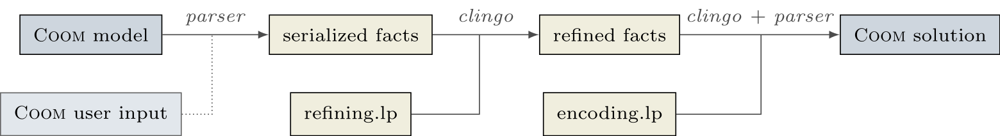

---
hide:
- navigation
- toc
---

# COOM Suite

The [COOM language][coom] is a domain-specific language
for modelling product configuration problems. While currently geared towards
ASP, the *COOM Suite* is intended to serve as a general workbench for
experimentation with industrial-scale product configuration problems. It
includes a (customizable) [ANTLR v4][antlr] parser to convert
COOM specifications into facts, and currently contains two [ASP encodings][encodings] for
solving: one for [clingo] and one for
hybrid solver [flingo].

In addition, a [user interface][ui], a range of [examples] and a [benchmark collection][benchmarks]
with four scalable benchmark sets is provided.

=== "Workflow"
    The workflow of the *COOM Suite* is as follows:

    1. First, the COOM input gets parsed and translated into
       a fact format which closely resembles the COOM language
    2. Next, these facts get refined by means of an ASP encoding
       into another, COOM-independent fact format
    3. This serves as input to another encoding solving the configuration problem
    4. The stable models can be parsed back into a COOM solution

    {width="1200"}

=== "COOM model"
    As an example consider the following simple COOM model:

    ```cpp
    product { //(1)!
        Bool    wheelSupport
        Wheel	frontWheel
        Wheel	rearWheel
    }

    enumeration Wheel { //(2)!
        attribute num size //(3)!

        W14	= (	 14	) //(4)!
        W16	= (	 16	)
        W18	= (	 18	)
        W20	= (	 20	)
    }


    behavior { //(5)!
        combinations  (wheelSupport	 rearWheel)
        allow         (True          (W14, W16)) //(6)!
        allow         (False         (W18, W20))
    }

    behavior {
        require frontWheel.size = rearWheel.size //(7)!
    }

    ```

    1. Product to be configured
    2. Enumerations provide a discrete number of options
    3. Additional attribute values can be defined for each option
    4. The option W14 has size 14
    5. The behavior keyword defines constraints
    6. A wheelSupport can be used only with rear wheels W14 and W16
    7. The size of the front and rear wheel have to be equal

=== "Example solution"

    To solve the COOM model, run

    ```console
    coomsuite solve simple.coom -n0 --output coom
    ```


    !!! info "clingo arguments"
        The usual clingo command-line arguments can be used,
        for instance, `-n0` above to calculate all stable models.

    !!! tip "COOM output"
        By default the COOM suite outputs the stable models.
        To get the COOM output add the option
        `--output coom` (or `-o` for short).

    This gives the following output

    ```shell
    COOM Suite version 0.1
    Reading from /tmp/tmpdz0jgc5o
    Solving...
    Answer: 1
    frontWheel[0] = "W18"
    frontWheel[0].size[0] = 18
    rearWheel[0] = "W18"
    rearWheel[0].size[0] = 18
    wheelSupport[0] = "False"
    Answer: 2
    frontWheel[0] = "W16"
    frontWheel[0].size[0] = 16
    rearWheel[0] = "W16"
    rearWheel[0].size[0] = 16
    wheelSupport[0] = "True"
    Answer: 3
    frontWheel[0] = "W20"
    frontWheel[0].size[0] = 20
    rearWheel[0] = "W20"
    rearWheel[0].size[0] = 20
    wheelSupport[0] = "False"
    Answer: 4
    frontWheel[0] = "W14"
    frontWheel[0].size[0] = 14
    rearWheel[0] = "W14"
    rearWheel[0].size[0] = 14
    wheelSupport[0] = "True"
    SATISFIABLE

    Models       : 4
    Calls        : 1
    Time         : 0.006s (Solving: 0.00s 1st Model: 0.00s Unsat: 0.00s)
    CPU Time     : 0.006s
    ```

!!! info
    The *COOM suite* is part of the [Potassco] suite (which is the home of *clingo* and other ASP tools)

If you want to cite the COOM Suite, please use the following reference.
Check out our paper [here](https://arxiv.org/pdf/2504.00013).

> J. Baumeister, S. Hahn, K. Herud, M. Ostrowski, J. Reutelshöfer, N. Rühling, T. Schaub, P. Wanko.
> Towards Industrial-scale Product Configuration. _CoRR_, abs/2504.00013, 2025.
> doi: 10.48550/arXiv.2504.00013. URL https://arxiv.org/abs/2504.00013.

[coom]: https://www.coom-lang.org/
[antlr]: https://www.antlr.org
[encodings]: reference/encodings/index.md
[clingo]: https://potassco.org/clingo
[flingo]: https://github.com/potassco/fclingo
[ui]: usage/ui.md
[examples]: examples/index.md
[benchmarks]: examples/benchmarks.md
[Potassco]: https://potassco.org
